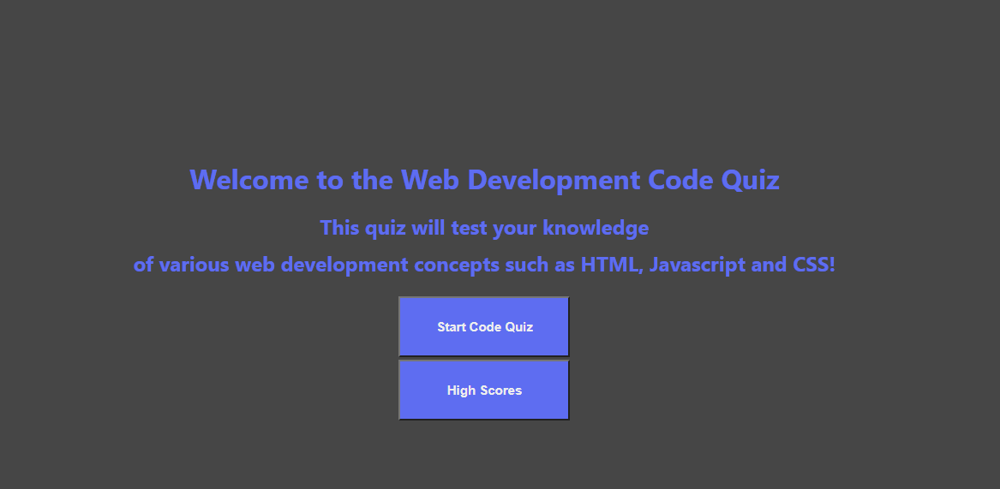

# Web Development Code Quiz

The purpose of this assignment was to create a timed, multiple choice quiz that covers topics we have learned so far in class by using the skill we have developed thus far in class. The quiz must run in the browser and feature dynamically updated HTML and CSS powered by Javascript code. 

## Acceptance Criteria

```````
GIVEN I am taking a code quiz
WHEN I click the start button
THEN a timer starts and I am presented with a question
WHEN I answer a question
THEN I am presented with another question
WHEN I answer a question incorrectly
THEN time is subtracted from the clock
WHEN all questions are answered or the timer reaches 0
THEN the game is over
WHEN the game is over
THEN I can save my initials and my score
```````
## Image of Webpage



## Link to Webpage

[Deployed Webpage](https://tmantena1.github.io/code-quiz/)
[GitHub](https://github.com/tmantena1/code-quiz)


